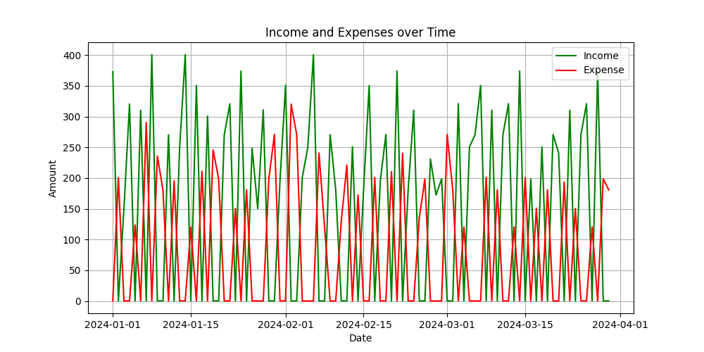

# Personal Finance Tracking Program

This is a Python-based Personal Finance Tracking program that allows you to efficiently manage and track your financial transactions. You can add transactions, view them within a specific time range, categorize them as income, expense, or savings, and even visualize your financial status with a line graph. The program saves and manages data using a CSV file for persistence.

## Features

- **Add Transactions**: Record your financial transactions specifying amount, date, category, and description.
- **View Transactions**: Display transactions within a specific date range.
- **Categorize Transactions**: Categorize transactions as income, expense, or savings.
- **Data Storage**: Persist transactions in a CSV file.
- **Data Visualization**: Plot a line graph showing income and expenses over time.
- **User-friendly Menu**: Operate the program using a simple menu-driven interface.

## Requirements

- Python 3.x
- `pandas`
- `matplotlib`

You can install the required packages using pip:

```bash
pip install pandas matplotlib
```

## Usage

1. **Clone the Repository** (if applicable):
    ```bash
    git clone <repository-url>
    cd <repository-directory>
    ```

2. **Run the Program**:
    ```bash
    python finance_tracker.py
    ```

3. **Menu Options**:
    - `1. Add new Transaction`: Add a new financial transaction specifying the date, amount, category, and description.
    - `2. View Transactions and summary within date range`: Display transactions within a specified date range, along with a summary of total income, expenses, and net savings. Optionally, plot a line graph.
    - `3. Exit`: Exit from the program.

## Example

### Adding a Transaction
```plaintext
Enter the transaction date (dd-mm-yyyy) or press Enter for today's date: 15-10-2023
Enter the transaction amount: 500
Enter the transaction category (Income/Expense): Income
Enter a description for the transaction: Salary
```

### Viewing Transactions
```plaintext
Enter the start date (dd-mm-yyyy): 01-10-2023
Enter the end date (dd-mm-yyyy): 31-10-2023
Transactions from 01-10-2023 to 31-10-2023
date        amount    category    description
15-10-2023  500       Income      Salary

Summary:
Total Income: $500.00
Total Expense: $0.00
Net Savings: $500.00
Do you want to see a plot? (y/n): y

```

### Plotting a Line Graph


## CSV Data Format

The transactions are stored in a CSV file named `finance_data.csv` with the following columns:

- `date`: The date of the transaction in `dd-mm-yyyy` format.
- `amount`: The amount of the transaction.
- `category`: The category of the transaction (Income/Expense).
- `description`: A brief description of the transaction.

Example:

```csv
date,amount,category,description
15-10-2023,500,Income,Salary
```

## Directory Structure

```
personal-finance-tracker/
├── finance_tracker.py
├── finance_data.csv
├── data_entry.py
├── README.md
└── transaction_plot.png
    
```

## Contributing

Contributions are welcome! Please open an issue to discuss what you would like to change.


## Contact

For any questions or feedback, please reach out to [itsmohsinlatif@gmail.com].

---

Thank you for using the Personal Finance Tracking Program!
```